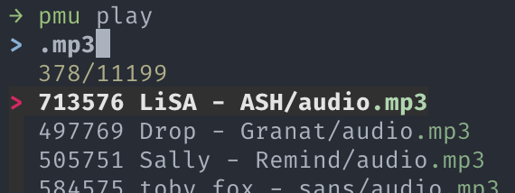
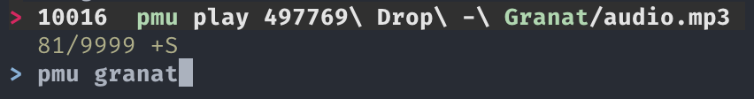
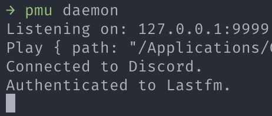

# pmu


**P**lay **mu**sic in your terminal!

## Features

### Play past songs from any directory

After you play a song, run the same command to play the same song even if you're in a different directory! Playback
history is stored in an SQLite database.

### Extract metadata from supported song folders

Metadata is automatically extracted from special song folders. Supported folders include those from:

- osu!
- Stepmania

### Discord Rich Presence

Show off the song you're playing in Discord!


### Last.fm scrobbling

Track the music you play on [last.fm](https://www.last.fm/)!


## Installation

```
$ cargo install --locked --git https://github.com/Techno-coder/pmu
```

## Usage

### Play a song

```
$ pmu play path/to/song.mp3
```

### Print help

```
$ pmu help
```

### Print configuration directory

```
$ pmu config
```

## Configuration

The configuration file is named `config.json`. The documentation for each option can be found [here](src/config.rs).

## Recommended additions

### [fzf](https://github.com/junegunn/fzf)

fzf lets you quickly search for audio files and past command history.





## Hotkey terminal

Some terminal emulators such as [iTerm2](https://iterm2.com) allow you to set a keyboard shortcut to instantly activate
a terminal window.

## Shell aliases

You can set aliases in your `~/.bashrc` or `~/.zshrc` profile to play songs faster:

```shell
alias song="pmu play --now"
alias pause="pmu pause"
alias stop="pmu stop"
```

## Troubleshooting

The daemon can be spawned manually with `pmu daemon`:


